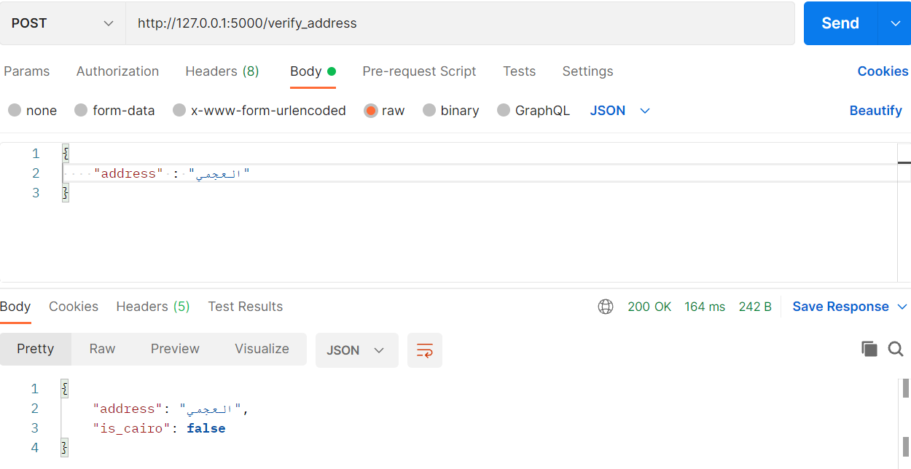

# Address Verification API

## Description
This project implements a Flask API for verifying whether an input address is in Cairo or not. It utilizes a trained model based on the provided dataset (`is_cairo_cities.csv`) and the TensorFlow/Keras framework.

## Project Structure
- **is_cairo_cities.csv:** Dataset for training the model.
- **tf_model.py:** Script to build and train the address verification model.
- **address_verification_model.keras:** Pre-trained Keras model for address verification.
- **app.py:** Initial Flask API implementation.
- **pp_app.py:** Flask API with parallel processing for faster predictions.
- **requirements.txt:** List of Python dependencies.
- **Dockerfile:** Instructions for building a Docker image.
- **docker-compose.yml:** Configuration for Docker Compose.

## Run the app locally
```bash
python pp_app.py

## Build Docker Image :
git clone https://github.com/moatazalazamy/Address-Verification-API.git
cd Address-Verification-API
docker-compose build
docker-compose up


## REST API
#### Create Request ```POST```
``` http://127.0.0.1:5000/verify_address```
##### request body raw
``` {"address":"المقطم"} ```
##### response
``` {"address": "المقطم","is_cairo": true} ```

##### screenshots from Postman


